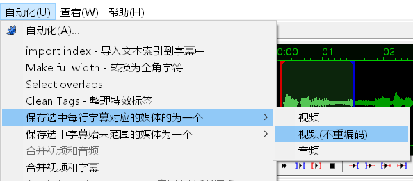
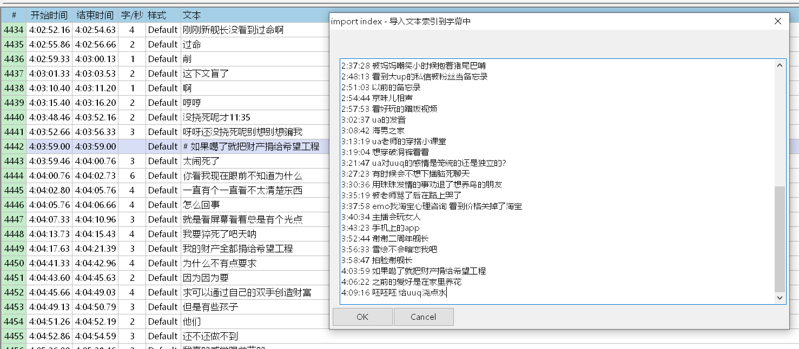
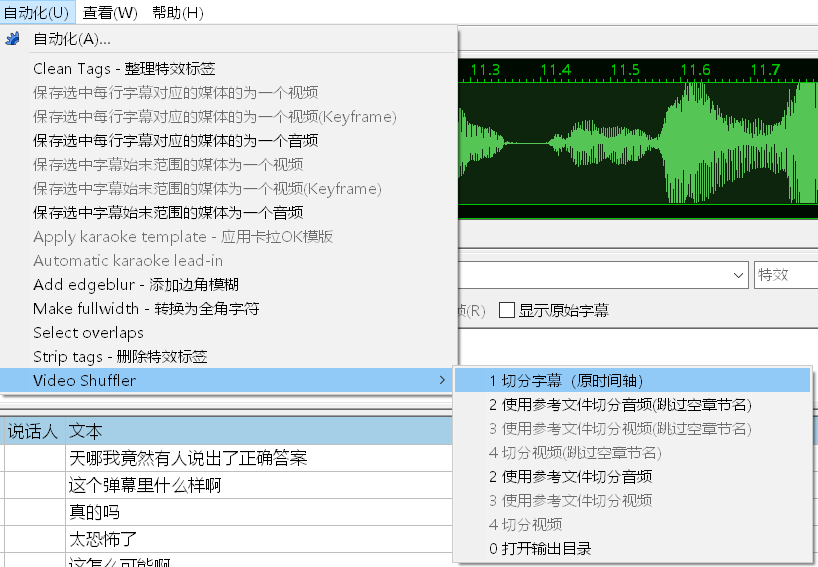

# Video Shuffler for Aegisub
Script for Aegisub to cut video and voice files.   
在Aegisub中用字幕切割视频和音频文件。

## 用法
1. 下载[ffmpeg](https://ffmpeg.org/download.html)  
2. 解压并把ffmpeg添加到系统环境变量中
3. 下载本仓库文件，复制到aegisub的`automation\autoload`目录中
4. 打开Aegisub，并加载字幕和视频/音频文件，选择`自动化-对应菜单命令`


## ffmpeg_cut.lua
使用ffmpeg对选中的字幕所对应的媒体文件进行切割。  
包含多种模式，根据描述有如下特性：

1. `保存选中每行字幕对应的媒体的为一个`和`保存选中字幕始末范围的媒体为一个`,即输出的结果是一个文件还是多个文件。
2. `视频`,`视频（keyframe）`和`音频`，即输出视频（速度慢），还是根据关键帧输出视频（时间点可能有问题，输出的音频可能错位，时间过短可能没有画面），还是输出音频。通常输出的格式与源文件的格式相同




## import_index.lua
把带时间信息的文本粘贴到文本框中，导入到字幕时间轴上，生成章节信息



## video_shuffler.lua
使用[video shuffler（洋片箱）](https://github.com/tumuyan/video-shuffler)对字幕和视频进行处理。  
由于洋片箱是一个Python工具，因此必须额外安装Python环境以及洋片箱这个工具，并且在脚本中设置洋片箱的路径，即脚本中的如下内容：
```
video_shuffler = "C:\\prg\\video-shuffler\\main.py"
```

包含多种模式，根据描述有如下特性：
1. 切分字幕（原时间轴）即只切分字幕，不切分媒体文件。此步骤会在字幕所在文件夹生成一个新文件夹，所有文件都会保存在这个文件夹内。其中名称为` content.txt`是一个章节目录，可以通过删除其中不需要的行，然后使用包含“参考文件”的命令时，只输出指定章节名的视频内容
2. 打开输出目录。只对Windows系统有效，打开生成的新文件夹



## 存在的问题
1. 部分文件在不同版本的Aegisub中加载后，存在时间轴错位的问题。这会导致导出结果的时间点有问题。